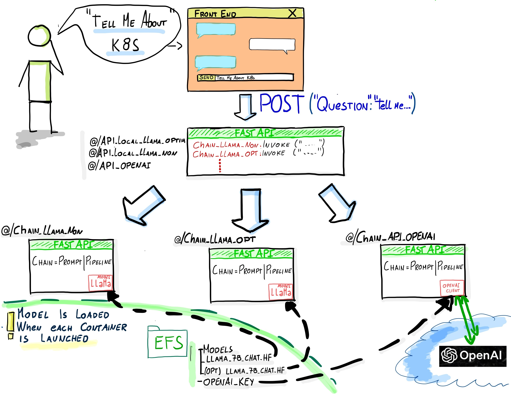
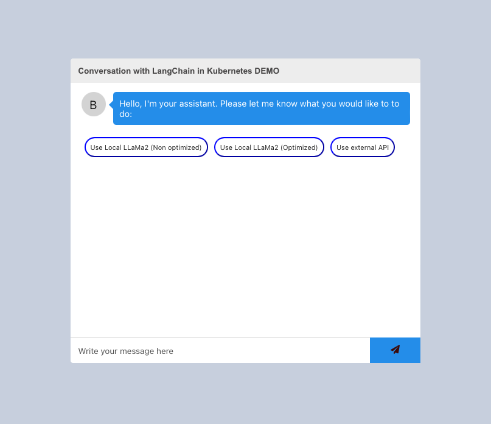

# Deploying LLMs in CloudNative using LangChain on Intel Developer Cloud (IKS)

Welcome to the repository dedicated to deploying a QA chatbot in Kubernetes utilizing open source tools.

This repository aims to provide a comprehensive, STEP-BY-STEP guide for implementing a chatbot on Kubernetes using open source tools. This document will walk you through each stage, from container creation to launching a Kubernetes server.

As we are employing local models, our practical setup will rely on multiple parts:

 - Container Registry(Amazon ECR). However, you can substitute these with your preferred container registry provider (Docker)
 - Cluster(IKS): Our cluster will be using the recently lauched service Intel Kubernetes Service (aka IKS) provided by Intel Developer Cloud 
 - File Server : We will be deploying a file server within the cluster provided. In your scenario this can be done using any File server provider.

# Description of the architecture

The architecture for this implementation is outlined below:



1. **Front End**:
   The front end is built using `react-chatbot-kit`, a versatile and customizable chatbot framework. You can find more information about `react-chatbot-kit` [here](https://www.npmjs.com/package/react-chatbot-kit).

1. **Front End for different models**:
   Since we will be using multiple LLMs, we would need to create one LLM 'front-end' to centralize all the requests and then send them to where each particular model is instantiated.

2. **Models**:
   This implementation relies on three different models:
   - **Local LLaMa2_7B**: llama-2-7b-chat-hf model downloaded from Hugging Face (https://huggingface.co/meta-llama/Llama-2-7b-chat-hf)  and stored on the file server.
   - **Local Optimized LLaMa2_7B**: An optimized version of the LLaMa2_7B model created using ITREX (details on optimization in the "How was the optimization done?" section). This optimized model is also stored on the file server.
   - **External Paid API**: OpenAI's paid API.

# Step by step

The proposed architecture serves as a foundational guide for deploying multiple Language Model Models (LLMs) in a Kubernetes environment.

Feel free to explore the provided resources and adapt the implementation to your specific use case.

Let's bring your chatbot to life on Kubernetes!


## 1. Clone the repository
```bash
git clone https://github.com/ezelanza/LangChain-in-Kubernetes.git
```

## 2. Create Containers

After cloning the project, navigate to each folder to create each container (docker). There is a Dockerfile in each folder with the instructions. In this case, we will BUILD it to run in an Intel processor, but you should change (--platform linux/amd64) it according to your platform.

*NOTE : BE SURE TO HAVE YOUR DOCKER ENGINE INSTALLED* Refer to https://www.docker.com 

Create REACT front end container
```bash
cd 1__Front_End 
    docker build --platform linux/amd64 -t front_end:latest .
```

Create Python Front_end_LLM container
```bash
cd 2__LLMs_Proxy
    docker build --platform linux/amd64 -t llms_proxy:latest .
```

Create Python LLM container for each model (In this example for LlaMa7B non optimized).
*Note : Repeat this step to all the containers you'd like to create*

```bash
cd 3__Local_Models/LLAMA-non 
    docker build --platform linux/amd64 -t llama7b-non-optimized:latest .
```
You should now be able to see both containers on your environment.
```bash
    docker images
```

## 3. Push containers to the registry
Your containers need to reside somewhere accessible so that they can be downloaded when the Kubernetes cluster is created.

There are several options available, including Amazon ECR and Docker HUB.

In this case, we will use Docker Hub. Refer to Docker documentation based on the operating system you're using to get instructions on creating your repository.

```bash
docker login
```
Tag your container (For example for front_end container)
```bash
docker tag front_end:1.0 <username>/front_end:1.0
```
And finally push it to your repository

```bash
docker push <username>/front_end:1.0
```

## 4. Download/Optimize models
For this example we will be using 3 different types of models. Follow "How to download a model from Hugging Face?" below section in order to download the models.

- **LlaMa2-7b-chat-hf Model** : Follow the instructions to locally download the model from hugging face and store it in your File server, in this demo will see that each local container loads de model from the mounted file server on the container. 
```
model_path="/efs_mounted/Models/llama-2-7b-chat-hf"    # Modify it accordly to your file server mount path defined on the deployment.yaml file.
```
- **OPTIMIZED : LlaMa2-7b-chat-hf Model** : Follow the Apendix section "How was the optimization done?" to perform the optimization. 
- **OpenAI API-GPT3.5/4** : This particular model is intended for use with the LangChain (ChatOpenAi) API. To utilize it, ensure your OpenAI_key is configured within the container for the External model. In the example, the key is linked to the EFS server where it is stored.
```python
#Open AI key stored on a File server
f = open('/efs_mounted/Models/openai_key.txt')
# Read the contents of the file into a variable
OPENAI_KEY = f.read()

model = ChatOpenAI(openai_api_key=OPENAI_KEY)
```

## 5. Set up your kubernetes enviroment
You can deploy your cluster on any cloud provider, or you can visit cloud.intel.com to set up your environment on the latest Intel Xeon or Gaudi generations. Follow this guide to connect to your environment :  https://console.cloud.intel.com/docs/guides/k8s_guide.html.

In our case we created the enviorment and nodes following this guide : https://console.cloud.intel.com/docs/guides/get_started.html . There is also explained how to configue your kubectl.

The configuration files for the cluster are the following:
###    - **Configuration files (yaml)**: 
   - **deployment.yaml**: This yaml file contains the configuration to perform deployments, and creates the services to each of them and set environments to be used:
        - **Horizontal and Vertical POD scaling**: The architecture employs two distinct scaling methodologies. Pods containing local models utilize Vertical Pod Scaling due to the prolonged launch time required for model downloads, rendering Horizontal Scaling impractical. Conversely, services such as Frontend, LLM Proxy, and OpenAI (LLM) can benefit from Horizontal Scaling. Refer to each deployment to verify this configuration.
        ```
        ---
apiVersion: autoscaling/v2
kind: HorizontalPodAutoscaler
metadata:
  name: openai
spec:
  scaleTargetRef:
    apiVersion: apps/v1
    kind: Deployment
    name: openai
  minReplicas: 1
  maxReplicas: 10
  metrics:
  - type: Resource
    resource:
      name: cpu
      target:
        type: Utilization
        averageUtilization: 50
        ```
        
        - **ServiceAccount**: The ServiceAccount and roles are created specifically to capture the IP address assigned to each BackEnd LLM service. This information is necessary for the LLM back_end to effectively forward incoming requests. This setup is exclusively utilized by the llm_front_end to facilitate the forwarding process for each request.
        - **VolumeMounts & Persistent Volume/Claim**:**: As mentioned earlier, every local LLM will be saved on a file server for access when pods containing local models are initiated. VolumeMounts are employed to connect the file server to the pod, specifying its internal address and "volumes" to specify the clain (pvc)to be used(created in efs_storage.yaml). Note that the local containers will be refencing to /fs_mounted for example, when the local model instantiates in 3__Local_Models/LLAMA-non/app/llama2.py, the model is downloaded from the fs mounted.
                        
        ```python
        model_path="/fs_mounted/Models/llama-2-7b-chat-hf"
        ```
        
        Please modify the configuration to align with your file server setup.
        
        ```
        containers....
        ....
                volumeMounts:
            - name: iks-volume-1
              mountPath: /fs_mounted
      imagePullSecrets:
        - name: ecr-secret
      volumes:
        - name: iks-volume-1
          persistentVolumeClaim:
            claimName: iks-claim50
        ```

        - **Image Containers**: URL of where containers were pushed.
        ```
        containers:
        - name: llama7b-non-optimized
          image:  <<YOUR CONTAINER REGISTRY URL>>:latest
        ```
        - **Worker assigment**: This demonstration utilizes two distinct worker groups (for frontend and backend). Each deployment is associated with a nodeAffinity that corresponds to the anticipated load requirements. In this demo setup, it's configured to utilize IKS node groups for managing the worker nodes. In this case node groups were created using IKS console.

        ```
        affinity:
        nodeAffinity:
          requiredDuringSchedulingIgnoredDuringExecution:
            nodeSelectorTerms:
            - matchExpressions:
              - key: kubernetes.io/hostname
                operator: In
                values:
                - ng-k75hck2u2i-5d2e2     #IKS NODE NAME
        ```

   - **ingress.yaml**: This file configures the ingress rules for the NGNIX controller.
   Ingress will route the trafic externally to pods/load balancers/services. 2 services will have this exposure.
    - **Front_end**:
    The front end is receiving user inputs and forwarding them to the LLM_proxy. 
    This configuration is to forward any "/" request to the frontend-service.
    ```dockerfile
      - path: /
        pathType: Prefix
        backend:
          service:
            name: frontend-service
            port:
              name: svc-port
    ```
    - **LLM_Proxy**: 
    In this setup, the front end generates various POST messages based on the model chosen by the user. Due to React's nature, these requests are not directly made through the backend; rather, it's the user's browser that initiates them. As a result, we need to incorporate the LLM_proxy derivation into the Ingress. 
    In this demo, users can choose to send their message to LLaMa2, LLaMa2 Optimized, or GPT (API). 
    
    Below is an example of how a request optimized for LLaMa will be directed to the LLM proxy (svc: llms-front-end-service).

    ```dockerfile
        - path: /api_local_llama_optim
            pathType: Prefix
            backend:
            service:
                name: llms-front-end-service
                port:
                name: svc-port
    ```
- **efs_storage.yaml**: 
    This configuration file outlines the Persistent Volume (PV) and Persistent Volume Claim (PVC) for the cluster. In this instance, we will be using the Host IKS provides and we will create a pv on /data path (You should download your models there) , but you should modify it according to your File Server setup.

    ```bash
    spec:
  storageClassName: manual
  capacity:
    storage: 50Gi
  accessModes:
    - ReadWriteOnce
  hostPath:
    path: "/data"
    ```


  *In cas you're using amazon EFS*
    ```bash
    csi:
    driver: efs.csi.aws.com
    volumeHandle: <<USE YOUR EFS URL/ACCESS POINT> 
    ```

This is how the kubernetes architecture will look like.


*NOTE :After you deploy your cluster, you would need to enable 'kubectl' access, since our example used amazon EKS, you can refer to https://docs.aws.amazon.com/eks/latest/userguide/create-kubeconfig.html in order to associate kubectl with the cluster prevously created and have defined the correct set of permissions*

### 5.1 Install Ngnix

Once we have access to the cluster and you've created the worker nodes (In our case we will create 2 nodes, but you can be as granular you can), the first step is to create the ingress controller/load balancer. In our example we selected NGNIX.
One of the primary uses of NGINX in Kubernetes is as an Ingress controller. Ingress is an API object that manages external access to services within a Kubernetes cluster. An Ingress controller is responsible for fulfilling requests for Ingress resources. NGINX can be configured as an Ingress controller to manage incoming traffic to the cluster, allowing you to route requests to different services based on hostnames, paths, or other rules.

```bash
helm upgrade --install ingress-nginx ingress-nginx \
  --repo https://kubernetes.github.io/ingress-nginx \
  --namespace ingress-nginx --create-namespace
```
Verify if your ngnix pods are running
```bash
kubectl get pods --namespace=ingress-nginx                                               
NAME                                        READY   STATUS    RESTARTS   AGE
ingress-nginx-controller-55474d95c5-j6g9w   1/1     Running   0          7m28s
```

### 5.2 Deploy services
In the root folder /LangChain-in-Kubernetes you will find the configuration for ingress. This configuration will allow NGINX to facilitate external communication. Specifically, it enables external users to interact with the front end. Since the front end operates within a browser environment, this setup ensures that the browser can access the LLMs_Front_end. 

```bash
kubectl apply -f ingress.yaml
```


### 5.3 Deploy pvc/pv  

Follow pv_pvc to mount your FS.

*FOR AWS_EKS: This configuration depends on which cluster provider yoiu are using, in our case for AWS EKS, we'd need to enable the CSI controller which will enable EFS to be consumed within the cluster. In order to enable it AWS allows it do add it from the web console. https://github.com/container-storage-interface/spec/blob/master/spec.md*

```bash
kubectl apply -f pv_pvc.yaml
```
This will create the pv and pvc in the cluster

### 5.4 Deploy pods
This is where you create all the containers and te configuration descripted on the .yaml file

```bash
kubectl apply -f deployment.yaml
```

This command will deplouy all pods!

```bash
% kubectl get pods
NAME                                     READY   STATUS    RESTARTS   AGE
frontend-7b8d8dd67-pgz8x                 1/1     Running   0          2m50s
llama7b-non-optimized-86bdbfddd6-f2rh5   1/1     Running   0          2m50s
llama7b-optimized-549c4fc7fb-djzcj       1/1     Running   0          2m50s
llms-front-end-8658696b8b-gtsh8          1/1     Running   0          2m50s
openai-78ffd4d84c-xn69j                  1/1     Running   0          2m50s

```

### 5.4 LET'S ACCESS! 

The services are exposed to Port:80, for demo purposes we will be forwarding them to our localhost:8000
```bash
kubectl port-forward -n ingress-nginx svc/ingress-nginx-controller 8000:80
```
Goto http://localhost:8000/



# Apendix

## How to download a model from Hugging Face?
Models typically live in Hugging Face, they can all be downloaded in order to perform local inference or to fine tune it. In this demo we will be downloading LLaMa2-7b-chat-hf model.

```python
# Download llama from HF
from transformers import AutoTokenizer, AutoModelForCausalLM

#Enter your local directory you want to store the model in
save_path = "Models/Llama-2-7b-chat-hf"

#Specify the model you want to download from HF
hf_model = 'meta-llama/Llama-2-7b-chat-hf'

#Instantiate the model and tokenizer (It downloads weights/architecture/parameters)
model = AutoModelForCausalLM.from_pretrained(hf_model, return_dict=True, trust_remote_code=True)
tokenizer = AutoTokenizer.from_pretrained(hf_model)

#Save the model and the tokenizer in the local directory specified earlier
model.save_pretrained(save_path)
tokenizer.save_pretrained(save_path)
```

Once your model is downloaded it has to be stored in your file server. The file server will be used as a PVC

## How was the optimization done?

We performed a weightonlyoptimization thanks to Intel Extensions for transformers. LlaMa2-7b-hf will be used and this step will help to reduce the size of the model from ~30GB to ~7GB. Thanks to techniques like quantization.

These are the steps you should follow in order to replicate it.

Before starting you should go ahead and clone the repository:
```bash
git clone https://github.com/intel/intel-extension-for-transformers
```

In our case, we will be using a new conda environment (Refer to xxx to install conda in your env)

```bash
conda create -n langchain python=3.10
```

### 1. Quantize the model
In order to have a model quantized we need to install ITREX

```bash
cd intel-extension-for-transformers 
pip install -r requirements.txt
python setup.py install

```
Once ITREX is installed you should refer to the folder where each different optimization is performed and install their requirements. In this case, we will be using Text-generation folder to quantize a Hugging Face model, you can navigate to other formats like Pytorch/TensorFlow:

```bash
cd examples/huggingface/pytorch/text-generation/quantization
pip install -r requirements.txt
```
We are now ready to perform the quantization. Since ITREX uses gcp libraries you might need to expose

```bash
find $CONDA_PREFIX | grep libstdc++.so.6
export LD_PRELOAD=/home/tensorflow/miniconda3/envs/langchain/lib/libstdc++.so.6

```
Let's perform the quantization!
The folder has a script (run_generation.py) which downloads the model from HuggingFace(In this case we will be using https://huggingface.co/meta-llama/Llama-2-7b-chat-hf), perform the quantization and saves the model in the same Hugging Face format for future inference.

```bash
python run_generation.py --model meta-llama/Llama-2-7b-chat-hf  --output_dir ./saved_llama     --woq

```
We now have the model quantized with the size reduced. It's now ready to be used as you normally use in a Hugging Face Pipeline.

```python
from langchain_community.llms.huggingface_pipeline import HuggingFacePipeline

#Install ITREX in order to use the API
from intel_extension_for_transformers.transformers import AutoModelForCausalLM

model_path = “path/to/model/”

optimized_model = AutoModelForCausalLM.from_pretrained(model_path,use_neural_speed=False,)

local_tokenizer=LlamaTokenizer.from_pretrained(model_path)

pipe= pipeline(task="text-generation", model=optimized_model, tokenizer=local_tokenizer,trust_remote_code=True, max_new_tokens=100, repetition_penalty=1.1, 	 model_kwargs={"max_length": 1200, "temperature": 0.01}) 

llm_pipeline = HuggingFacePipeline(pipeline=pipe)

```


